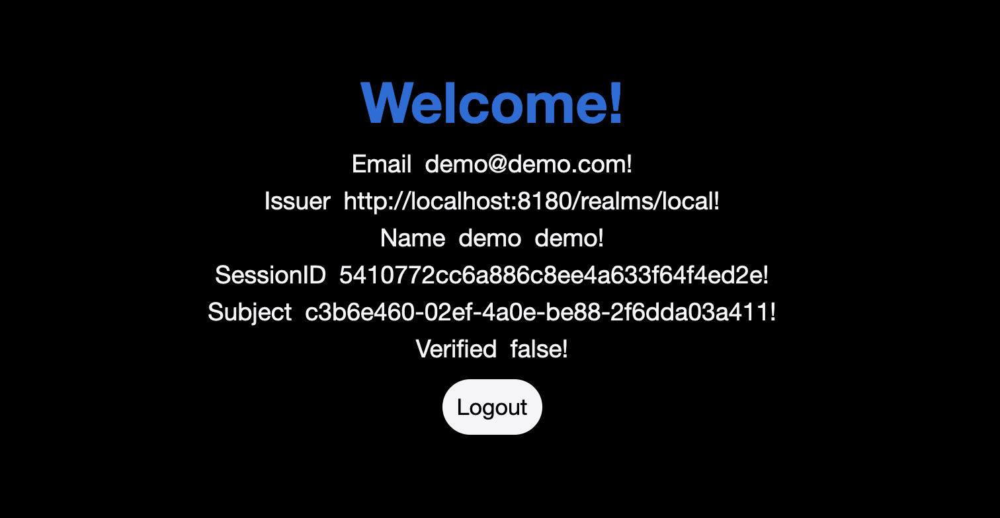

<p align="center">

</p>

# Cloud Native App

[](https://github.com/andygeiss/cloud-native-app/blob/master/LICENSE)
[](https://github.com/andygeiss/cloud-native-app/releases)
[](https://goreportcard.com/report/github.com/andygeiss/cloud-native-app)
[](https://app.codacy.com/gh/andygeiss/cloud-native-app/dashboard?utm_source=gh&utm_medium=referral&utm_content=&utm_campaign=Badge_grade)
[](https://app.codacy.com/gh/andygeiss/cloud-native-app/dashboard?utm_source=gh&utm_medium=referral&utm_content=&utm_campaign=Badge_coverage)

**Cloud Native App** automates the process of bootstrapping a repository.
It generates a project structure with everything you need to start coding right away.

## Project Motivation

The motivation behind **Cloud Native App** is to provide a practical example of implementing
a cloud-native application that adheres to best practices. The project aims to:

1. Automate the process of setting up a new repository.
2. Provide a project structure that follows best practices.
3. Offer a reference implementation for features like CI/CD, testing, and documentation.
4. Inspire developers to adopt cloud-native patterns in their projects.

## Project Setup and Run Instructions

Follow these steps to set up and run the **Cloud Native App**:

### Prerequisites

1. Install the latest version of [Go](https://golang.org/dl/).
2. Install the latest version of [Just](https://github.com/casey/just).
3. Include `$HOME/bin` in your `$PATH`.

### Installation

Clone the repository and install the `cloud-native-app` binary into `$HOME/bin`:

```bash
just install
```

### Usage

Change to your target directory and create a new demo module:

```bash
cloud-native-app demo
```

Navigate into the newly created demo directory and start the HTTP service on port 8080:

```bash
cd demo
just run-service
```

### Start Kafka and Keycloak

Start Kafka and Keycloak on your local machine by running the following commands:

```bash
podman run --restart=always --name keycloak -d -p 127.0.0.1:8180:8080 -e KC_BOOTSTRAP_ADMIN_USERNAME=admin -e KC_BOOTSTRAP_ADMIN_PASSWORD=admin quay.io/keycloak/keycloak:26.3.4 start-dev
podman run  --restart=always --name kafka -d -p 127.0.0.1:9092:9092 apache/kafka:latest
```

### Setup Keycloak

We need to configure Keycloak to work with our application. Follow these steps:

1. Open the Keycloak admin console in your browser: [http://localhost:8180/auth/admin](http://localhost:8180/auth/admin)
2. Log in with the admin credentials you provided during the Keycloak setup.
3. Create a new realm `local` for your application.
4. Create a new client `demo` for your application.
5. Configure the client to use the appropriate authentication flow and scopes.
6. Create new credentials (`client_id`, `client_secret`) for the client.
7. Create a new user `test` with name `test test` for your application.
8. Replace the OIDC configuration to use the credentials from Keycloak.

```env
OIDC_CLIENT_ID="demo"
OIDC_CLIENT_SECRET="8d6Gb5ZDNY2qlvFxCRNmPh3gozKtidRQ"
```

### Visit the UI

Open the UI in your browser:

[http://localhost:8080/ui](http://localhost:8080/ui])


